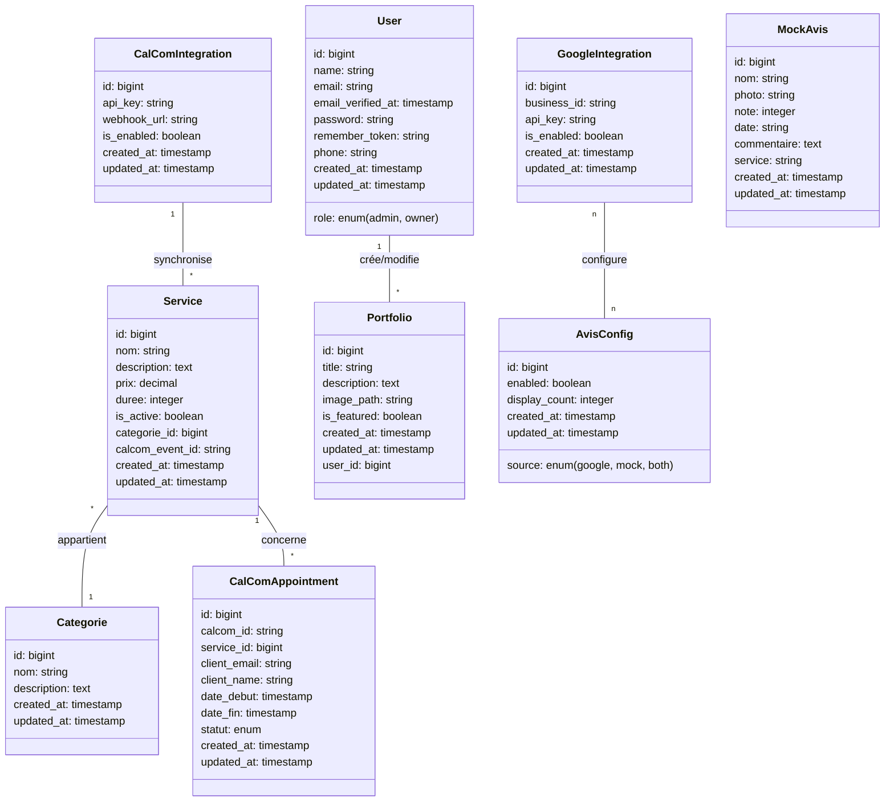

# Diagramme de Classes - Base de Données EFFYNAILS

## Modèle de Données

## Description des Entités

### User (Utilisateur)

-   Représente les administrateurs du site
-   Par défaut, tous les utilisateurs sont des administrateurs (`role = 'admin'`)
-   Gère le contenu du site (portfolio, services)
-   L'inscription est ouverte à tous

### Service

-   Représente les différentes prestations offertes par EFFYNAILS
-   Contient le prix et la durée
-   Appartient à une catégorie
-   Synchronisé avec Cal.com pour la réservation
-   `calcom_event_id` permet de lier le service à un événement spécifique dans Cal.com

### Categorie

-   Classification des services (ex: Manucure, Nail Art, etc.)
-   Permet d'organiser les services dans l'interface

### Portfolio

-   Images des réalisations d'EFFYNAILS
-   Affichées sur la page d'accueil et dans la galerie portfolio
-   Certaines peuvent être mises en avant (`is_featured`)

### GoogleIntegration

-   Stocke les informations de connexion à l'API Google Business
-   Permet d'afficher et de gérer les avis Google

### CalComIntegration

-   Contient les clés API et webhooks pour l'intégration avec Cal.com
-   Permet la synchronisation des réservations externes

### MockAvis

-   Données de démonstration pour les avis clients
-   Utilisées lorsque les avis Google ne sont pas disponibles ou désactivés

### AvisConfig

-   Configuration d'affichage des avis sur le site
-   Permet d'activer/désactiver l'affichage des avis
-   Détermine la source des avis (Google, mock ou les deux)

### CalComAppointment

-   Représente les rendez-vous pris via Cal.com
-   Contient les informations du client, le service concerné, et les horaires
-   Permet de suivre le statut du rendez-vous

## Intégrations Externes

### Google Business Profile

-   Les avis clients sont gérés via Google Business, pas directement dans la base de données
-   L'intégration se fait via un widget sur le site

### Cal.com

-   Le système de réservation est géré via Cal.com, un service externe
-   Les disponibilités et rendez-vous ne sont pas stockés dans la base de données EFFYNAILS
-   L'intégration se fait via des API et webhooks

## Fonctionnement du Système

1. **Réservation** :

    - Le client clique sur un bouton de réservation sur le site EFFYNAILS
    - Il est redirigé vers le système Cal.com
    - Il sélectionne un service et un créneau disponible
    - La confirmation est gérée par Cal.com

2. **Avis clients** :

    - Les avis sont laissés par les clients sur Google Business
    - Le site EFFYNAILS affiche ces avis via un widget Google
    - En cas d'indisponibilité, des avis mock peuvent être affichés

3. **Portfolio** :
    - L'administrateur ajoute des photos de ses réalisations
    - Ces photos sont affichées dans la galerie et sur la page d'accueil
    - Les images sont stockées sur le serveur dans le dossier `/storage`
